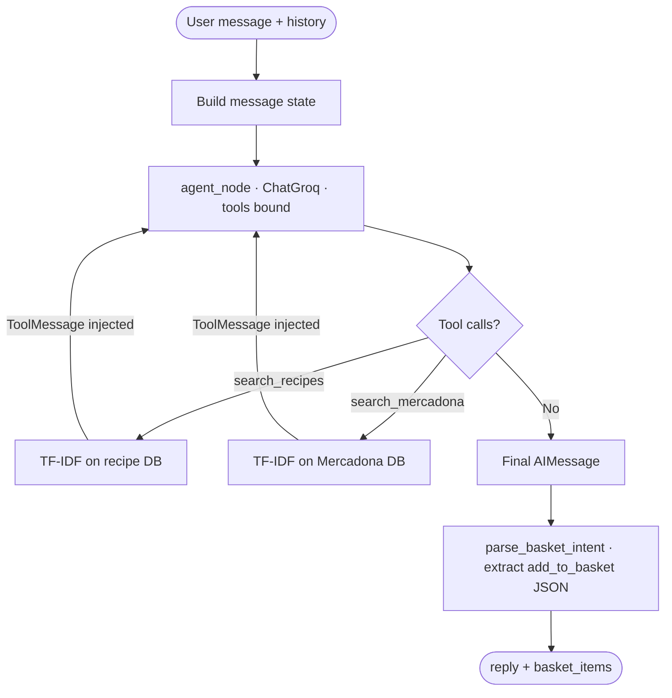
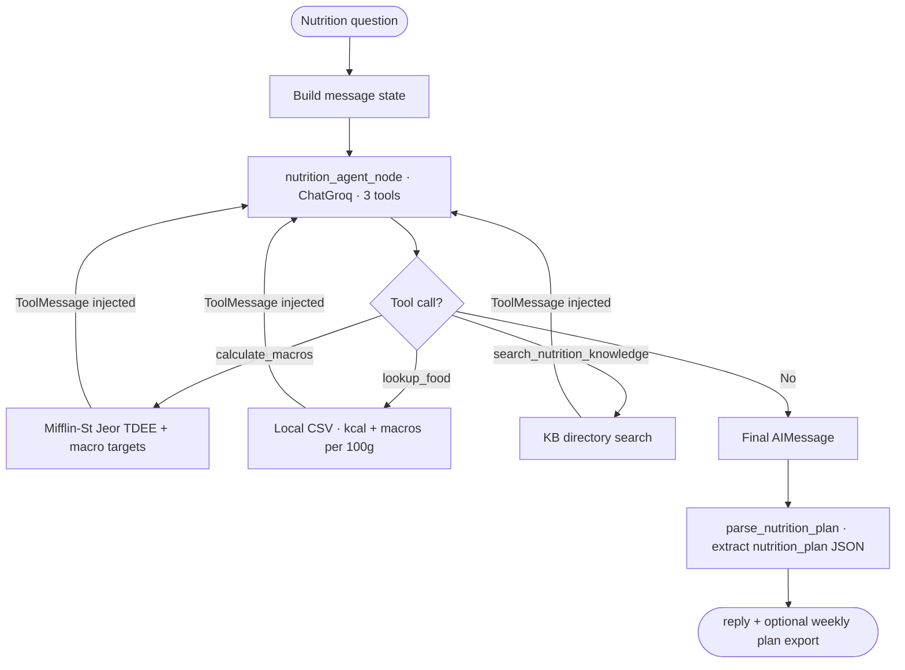
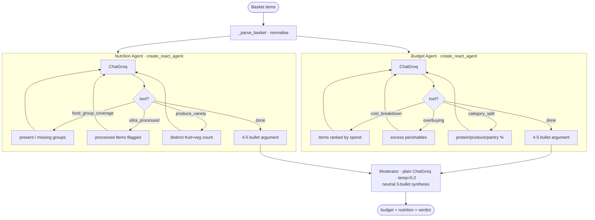
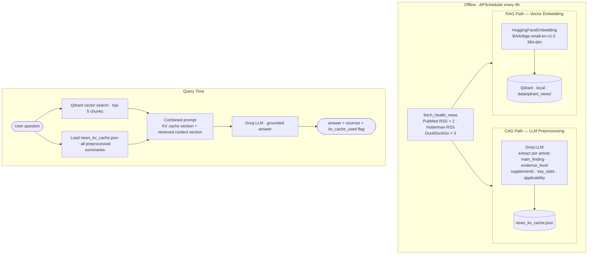
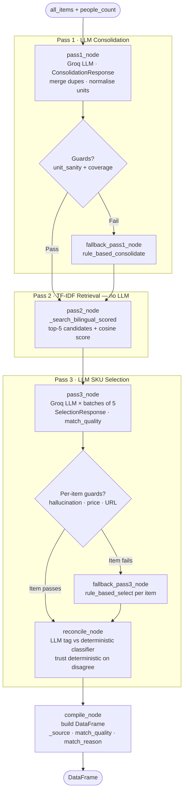

# LangGraph Structure — Grocery Shopping Optimizer

All LLM pipelines. Every agent uses **Groq `llama-3.3-70b-versatile`** as the single provider.

---

## 1. Grocery RAG Agent — `services/rag.py`

**Pattern:** `create_react_agent` (prebuilt ReAct loop)  
**Entry:** `rag_answer(question, messages_history, api_key) → str`

| Component | Implementation |
|---|---|
| Memory | LangChain message list (SystemMessage + history + HumanMessage) |
| Tools | `search_recipes` — TF-IDF on recipe DB · `search_mercadona` — TF-IDF on Mercadona DB |
| Orchestrator | `ChatGroq` temp=0.3 |
| Planning | ReAct loop — LLM decides which tool to call and when |
| Feedback | Tool results injected back as ToolMessages; loop continues until no tool calls |



---

## 2. Nutrition Coach Agent — `services/nutrition_agent.py`

**Pattern:** `create_react_agent`  
**Entry:** `nutrition_answer(question, messages_history, api_key) → str`

| Component | Implementation |
|---|---|
| Memory | LangChain message list |
| Tools | `calculate_macros` — Mifflin-St Jeor TDEE · `lookup_food` — USDA CSV · `search_nutrition_knowledge` — KB search |
| Orchestrator | `ChatGroq` temp=0.3 |
| Planning | Must call `calculate_macros` before stating targets; must call `lookup_food` before citing nutrition values |
| Feedback | Tool results loop back; agent refines until complete |



---

## 3. Basket Debate — Multi-Agent — `services/debate.py`

**Pattern:** Two `create_react_agent` instances + Moderator plain invoke  
**Entry:** `debate_basket(items, api_key) → dict`

| Component | Budget Optimizer | Nutritionist |
|---|---|---|
| Memory | LangGraph message state | LangGraph message state |
| Tools | `get_basket_cost_breakdown` · `identify_overbuying` · `get_category_cost_split` | `check_food_group_coverage` · `identify_ultra_processed` · `count_produce_variety` |
| Orchestrator | `ChatGroq` temp=0.3 | `ChatGroq` temp=0.3 |
| Planning | Calls all 3 cost tools, then synthesises | Calls all 3 nutrition tools, then synthesises |
| Feedback | Tool results loop back | Tool results loop back |



---

## 4. News RAG + CAG — `services/news_rag.py`

**Pattern:** LlamaIndex `VectorStoreIndex` (RAG path) + Groq LLM preprocessing (CAG path)  
**Entry:** `query_news(question, api_key) → dict`



---

## 5. Shopping Pipeline — StateGraph — `core/shopping.py`

**Pattern:** LangGraph `StateGraph` with typed state and conditional fallback edges  
**Entry:** `optimize_shopping_list_groq(items, groq_client, people_count) → DataFrame`



**State type:**

```python
class ShoppingState(TypedDict):
    all_items:    list        # raw ingredient rows from meal plan
    people_count: int
    groq_client:  Any
    feedback:     dict        # data/pack_feedback.json
    raw_lines:    list[str]
    consolidated: list[dict]  # Pass 1 output
    pass1_source: str         # "llm" | "fallback"
    cand_ctx:     list[dict]  # Pass 2 output
    rows:         list[dict]  # Pass 3 output
    error:        str | None
```

---

## Full System Overview

```mermaid
flowchart LR
    subgraph FE[Frontend SPA]
        P1[Chat Panel]
        P2[Planner + Basket]
        P3[Nutrition Coach]
        P4[Body Optimizer]
    end

    subgraph API[FastAPI server.py]
        E1[/api/chat]
        E2[/api/shopping-list/generate]
        E3[/api/nutrition-chat]
        E4[/api/debate]
        E5[/api/body/news/query]
    end

    subgraph LANG[LangGraph Agents]
        G1[Grocery RAG\ncreate_react_agent · 2 tools]
        G2[Nutrition Coach\ncreate_react_agent · 3 tools]
        G3[Budget Optimizer\ncreate_react_agent · 3 tools]
        G4[Nutritionist\ncreate_react_agent · 3 tools]
        G5[Moderator · plain invoke]
    end

    subgraph PIPE[Other Pipelines]
        S1[Shopping StateGraph\nPass1 → Pass2 → Pass3]
        S2[News RAG+CAG\nQdrant + KV Cache]
    end

    P1 --> E1 --> G1
    P3 --> E3 --> G2
    P2 --> E2 --> S1
    P2 --> E4 --> G3 & G4 --> G5
    P4 --> E5 --> S2

    GROQ(["☁️ Groq · llama-3.3-70b-versatile"])
    G1 & G2 & G3 & G4 & G5 & S1 & S2 -.->|all LLM calls| GROQ
```
